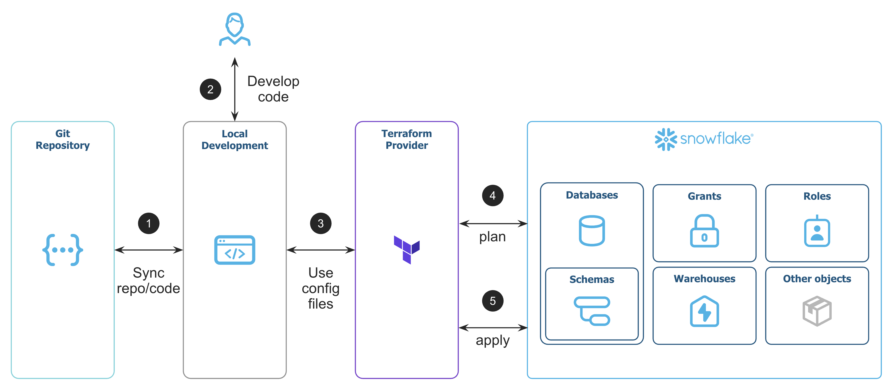

# Getting Started with Snowflake and Terraform

This repository contains the code for the Terraforming Snowflake tutorial.
https://quickstarts.snowflake.com/guide/terraforming_snowflake

## Helpful links
https://registry.terraform.io/providers/snowflakedb/snowflake/latest/docs

## What You'll Learn
- Basic Terraform usage
- How to create users, roles, databases, schemas, and warehouses in - Terraform
- How to manage objects from code/source control

## What You'll Need
- A Snowflake account - create a trial account if needed
- A GitHub account
- VSC Marketplace:
    - Snowflake
    - HashiCorp Terraform
    - Microsoft Terraform

## What You'll Build
A repository containing a Terraform project that manages Snowflake account objects through code. In practice, the workflow looks like this:
1. Create GitHub repository to version control the code
2. Develop Terraform code to manage Snowflake objects
3. Setup config files and initialize the Terraform Provider
4. Plan the changes on Snowflake
5. Apply the changes to Snowflake
6. Terraforming_Snowflake_Overview

#### Pre-liminary Steps
On Terminal/Powershell:
1. Create an RSA key for Authentication
    1. cd ~/.ssh
    2. openssl genrsa 2048 | openssl pkcs8 -topk8 -inform PEM -out rsa_key.p8 -nocrypt
    3. openssl rsa -in rsa_key.p8 -pubout -out rsa_key.pub

On Snowsight:
1. Ensure the following has been created:
    - Database: ENV_DB
    - Schema: DEV
2. Open a worksheet setting the Database and Schema to the above
    - Run the following code:
        CREATE USER TERRAFORM_SVC
            TYPE = SERVICE
            COMMENT = "Service user for Terraforming Snowflake"
            RSA_PUBLIC_KEY = "<RSA_PUBLIC_KEY_HERE>";

        GRANT ROLE SYSADMIN TO USER TERRAFORM_SVC;
        GRANT ROLE SECURITYADMIN TO USER TERRAFORM_SVC;
        -- Note: We grant the user SYSADMIN and SECURITYADMIN privileges to keep the lab simple. An important security best practice, however, is to limit all user accounts to least-privilege access. In a production environment, the public key should also be secured with a secrets management solution like HashiCorp Vault, Azure Key Vault, AWS Secrets Manager, etc.
On this Repository:
1. main.tf: 
    - Replace the your_org_name and your_account_name with your own
    - Update the private_key file path if you've created it somewhere else

#### Initialize the Project
On VSC Terminal: 
1. terraform init
    - Note: In this demo, we use a local backend for Terraform, which means that state file are stored locally on the machine running Terraform. For any kind of multi-tenancy or automation workflows, it is highly recommended to use remote backends, which is outside the scope of this lab: https://developer.hashicorp.com/terraform/language/backend/remote
  